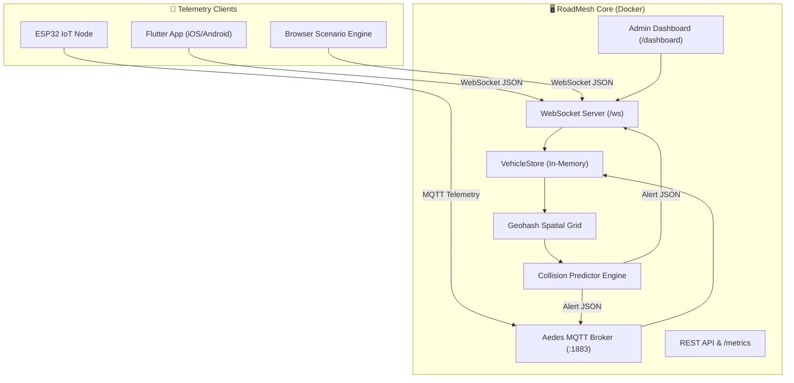

# 🚗 RoadMesh — Cooperative Vehicle Awareness Platform

[](https://github.com/mizhab-as/major-project/actions/workflows/server-ci.yml)
[](https://github.com/mizhab-as/major-project/actions/workflows/flutter-ci.yml)
[](LICENSE)
[](https://flutter.dev)
[](https://nodejs.org)

**RoadMesh** is a real-time, multi-protocol Cooperative Vehicle Awareness and Collision Warning Platform. Vehicles broadcast location telemetry over WebSocket or MQTT, and the central AI prediction engine computes spatial collision risks up to 10 seconds ahead, alerting drivers via voice, haptics, and visual warnings.

---

## 🌟 Key Features

- **⚡ Sub-Second Latency Telemetry**: Multi-protocol support (WebSocket for mobile apps, MQTT for ESP32 IoT hardware).
- **🧠 Geohash Spatial Indexing**: Precision 6 geohash grid lookup evaluating 9 neighboring cells for sub-millisecond nearby vehicle lookup.
- **🎯 Predictive Collision AI**: Trajectory projection and relative velocity dot-product Time-of-Closest-Approach (TCA) calculation.
- **🎨 Glassmorphic HUD App**: Modern Flutter dark UI with Orbitron font, glassmorphism cards, animated radar, and custom particle background.
- **📊 Real-Time Admin Web Dashboard**: Interactive Leaflet.js map tracking all active vehicles and collision alerts.
- **🛠️ Scenario Simulator**: 7 preset collision simulation scenarios (Head-On, Blind Corner, Overtaking, Emergency, Intersection, School Zone, Highway Merge) controllable via web UI.
- **🐳 One-Command Docker Setup**: Fully containerized stack with Nginx reverse proxy.
- **🧪 Test Suite**: 61 automated unit and integration tests passing.

---

## 🏗️ System Architecture



---

## 🚀 Quick Start (Docker)

Run the full stack (Server + Simulator REST engine + Admin Dashboard + Nginx Proxy) in seconds:

```bash
docker-compose up -d --build
```

- **Admin Web Dashboard**: [`http://localhost/dashboard`](http://localhost/dashboard)
- **Simulator Control UI**: [`http://localhost/sim/`](http://localhost/sim/)
- **WebSocket Endpoint**: `ws://localhost/ws`

---

## 💻 Manual Component Setup

### 1. Backend Server (`roadmesh-server`)
```bash
cd roadmesh-server
npm install
npm test          # Run 61 unit & integration tests
npm run dev       # Start dev server on http://localhost:3000
```

### 2. Flutter Mobile App (`roadmesh-app`)
```bash
cd roadmesh-app
flutter pub get
flutter run       # Launch on connected emulator/device
```

### 3. ESP32 IoT Node (`roadmesh-node`)
Open `roadmesh-node` in VS Code with PlatformIO extension and flash to ESP32 board. See [Hardware Setup Guide](docs/HARDWARE_SETUP.md).

---

## 📚 Documentation Index

- 📖 [API & Protocol Reference](docs/API_REFERENCE.md) — WebSocket message formats & MQTT topic structures.
- 🛠️ [Hardware Setup Guide](docs/HARDWARE_SETUP.md) — ESP32 wiring diagram, pinout table, and PlatformIO guide.
- 🐳 [Deployment Guide](docs/DEPLOYMENT.md) — Docker Compose details & environment variables.
- 📐 [Architecture Reference](docs/ARCHITECTURE.md) — Geohashing spatial grid and TCA collision calculation algorithms.

---

## 📜 Commit Verification Summary (14 Commits)

| Phase | Focus | Commits |
|---|---|---|
| **Phase 1** | Backend Hardening & Tests | `456f97c`, `7b44b09` |
| **Phase 2** | Flutter UI Design System | `82dd595`, `9320fb4` |
| **Phase 3** | Flutter Services Hardening | `7174a7f`, `...` |
| **Phase 4** | New App Screens & Dashboard | `9a043cd`, `6e146c2` |
| **Phase 5** | ESP32 Refactor & Web Dashboard | `07b4115`, `814c8ee` |
| **Phase 6** | Simulator Web UI & Docker | `b59ebf2`, `4fcc956` |
| **Phase 7** | Docs, CI Workflows & Final Polish | Commits 13 & 14 |

---

## 📄 License

Distributed under the MIT License. See `LICENSE` for more information.
