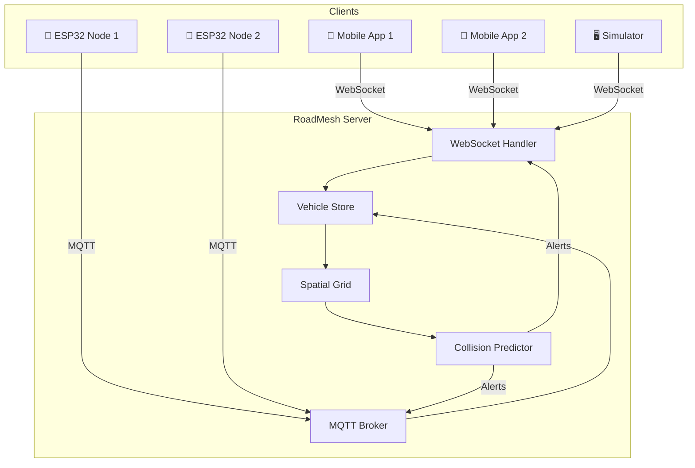

# RoadMesh – Implementation Plan

## Overview

RoadMesh is a Cooperative Vehicle Awareness Platform with two client implementations (Flutter mobile app + ESP32 IoT node) communicating through a shared real-time backend. This plan builds the entire system from scratch in a monorepo structure.

## User Review Required

> [!IMPORTANT]
> **Technology Stack Decisions** — Please confirm these choices:
> 1. **Backend**: Node.js + TypeScript + Express + WebSocket (`ws` library) + MQTT (`aedes` embedded broker)
> 2. **Mobile**: Flutter (Dart) with Google Maps SDK
> 3. **Database**: Redis for real-time vehicle state, PostgreSQL + PostGIS for persistence (optional later)
> 4. **IoT**: ESP32 + NEO-6M GPS, communicating via MQTT over WiFi
> 5. **Protocol**: JSON messages over WebSocket (mobile) and MQTT (IoT), same payload format

> [!WARNING]
> **Google Maps API Key Required** — You will need a Google Maps API key with Maps SDK for Android/iOS enabled. Do you already have one, or should we use OpenStreetMap/Mapbox instead?

> [!IMPORTANT]
> **Build Order** — I propose building in this order to get a working demo ASAP:
> 1. Backend server (WebSocket + MQTT + spatial logic) — **~1 session**
> 2. Flutter mobile app (GPS tracking, map, warnings) — **~2 sessions**
> 3. ESP32 firmware — **~1 session**
> 4. Vehicle simulator for demo — **~30 min**
>
> Do you want to adjust this priority?

---

## Proposed Changes

### Project Structure

```
major-project/
├── README.md
├── roadmesh-server/          # Backend
│   ├── package.json
│   ├── tsconfig.json
│   ├── src/
│   │   ├── index.ts          # Entry point
│   │   ├── server.ts         # Express + WS + MQTT setup
│   │   ├── spatial/
│   │   │   ├── geohash.ts    # Geohash encoding/decoding
│   │   │   └── grid.ts       # Spatial grid manager
│   │   ├── vehicles/
│   │   │   ├── store.ts      # In-memory vehicle state
│   │   │   └── types.ts      # Vehicle message types
│   │   ├── collision/
│   │   │   ├── predictor.ts  # Collision prediction engine
│   │   │   └── alerts.ts     # Alert generation
│   │   ├── protocol/
│   │   │   ├── websocket.ts  # WebSocket handler
│   │   │   └── mqtt.ts       # MQTT handler
│   │   └── utils/
│   │       ├── geo.ts        # Haversine, bearing calculations
│   │       └── logger.ts     # Logging utility
│   └── tests/
├── roadmesh-app/             # Flutter mobile app
│   ├── pubspec.yaml
│   ├── lib/
│   │   ├── main.dart
│   │   ├── config/
│   │   │   └── constants.dart
│   │   ├── models/
│   │   │   ├── vehicle.dart
│   │   │   └── alert.dart
│   │   ├── services/
│   │   │   ├── location_service.dart
│   │   │   ├── websocket_service.dart
│   │   │   └── collision_service.dart
│   │   ├── providers/
│   │   │   ├── driving_provider.dart
│   │   │   └── vehicle_provider.dart
│   │   ├── screens/
│   │   │   ├── home_screen.dart
│   │   │   └── driving_screen.dart
│   │   └── widgets/
│   │       ├── vehicle_marker.dart
│   │       ├── warning_overlay.dart
│   │       └── status_bar.dart
│   └── assets/
├── roadmesh-node/            # ESP32 firmware
│   ├── platformio.ini
│   └── src/
│       └── main.cpp
└── tools/
    └── simulator.js          # Vehicle position simulator
```

---

### Component 1: Backend Server (`roadmesh-server`)

#### [NEW] [package.json](roadmesh-server/package.json)
- Node.js project with dependencies: `express`, `ws`, `aedes`, `uuid`, `ngeohash`
- Dev dependencies: `typescript`, `ts-node`, `@types/*`, `vitest`

#### [NEW] [types.ts](roadmesh-server/src/vehicles/types.ts)
- `VehicleState` interface: `id`, `lat`, `lng`, `speed`, `heading`, `vehicleType`, `timestamp`
- `CollisionAlert` interface: `vehicleA`, `vehicleB`, `riskLevel`, `timeToCollision`, `alertType`
- Message types: `POSITION_UPDATE`, `NEARBY_VEHICLES`, `COLLISION_WARNING`, `HEARTBEAT`

#### [NEW] [geo.ts](roadmesh-server/src/utils/geo.ts)
- `haversineDistance(lat1, lng1, lat2, lng2)` — distance between two GPS points in meters
- `calculateBearing(lat1, lng1, lat2, lng2)` — compass bearing between points
- `predictPosition(lat, lng, speed, heading, seconds)` — future position projection

#### [NEW] [geohash.ts](roadmesh-server/src/spatial/geohash.ts)
- Encode GPS coordinates to geohash at precision 6 (~1.2km cells)
- Get neighboring geohash cells for boundary coverage
- Used to efficiently find nearby vehicles without iterating all vehicles

#### [NEW] [grid.ts](roadmesh-server/src/spatial/grid.ts)
- `SpatialGrid` class maintaining a `Map<geohash, Set<vehicleId>>`
- `updateVehicle(id, lat, lng)` — moves vehicle between cells
- `getNearbyVehicles(lat, lng, radiusMeters)` — returns vehicles within radius

#### [NEW] [store.ts](roadmesh-server/src/vehicles/store.ts)
- In-memory `Map<vehicleId, VehicleState>` for all connected vehicles
- Auto-expiry of stale vehicles (no update in 10 seconds)
- Integrates with `SpatialGrid` for spatial queries

#### [NEW] [predictor.ts](roadmesh-server/src/collision/predictor.ts)
- `predictCollisions(vehicle, nearbyVehicles)` — collision prediction engine
- Projects positions forward 1–10 seconds using speed + heading
- Calculates minimum future distance between vehicle pairs
- Returns alerts with risk levels: `GREEN`, `YELLOW`, `RED`
- Alert types: `HEAD_ON`, `OVERTAKE`, `BLIND_CORNER`, `REAR_END`, `LANE_MERGE`

#### [NEW] [websocket.ts](roadmesh-server/src/protocol/websocket.ts)
- Handles mobile client connections via WebSocket
- On `POSITION_UPDATE`: update store → query nearby → run collision prediction → respond with `NEARBY_VEHICLES` + `COLLISION_WARNING`
- Connection lifecycle: assign anonymous UUID, track, cleanup on disconnect

#### [NEW] [mqtt.ts](roadmesh-server/src/protocol/mqtt.ts)
- Embedded MQTT broker using `aedes`
- Topic structure: `roadmesh/vehicles/{vehicleId}/position` (publish), `roadmesh/nearby/{geohash}` (subscribe)
- Bridges MQTT messages into the same vehicle store as WebSocket clients

#### [NEW] [server.ts](roadmesh-server/src/server.ts)
- Express HTTP server on port 3000
- WebSocket upgrade on `/ws`
- MQTT broker on port 1883
- Health check and stats endpoints

#### [NEW] [index.ts](roadmesh-server/src/index.ts)
- Entry point, starts server with configuration

---

### Component 2: Flutter Mobile App (`roadmesh-app`)

#### [NEW] [pubspec.yaml](roadmesh-app/pubspec.yaml)
- Dependencies: `google_maps_flutter`, `geolocator`, `web_socket_channel`, `provider`, `flutter_tts`, `sensors_plus`, `vibration`

#### [NEW] [vehicle.dart](roadmesh-app/lib/models/vehicle.dart)
- `Vehicle` model matching server's `VehicleState`
- `VehicleType` enum: `CAR`, `TRUCK`, `MOTORCYCLE`, `BUS`, `AMBULANCE`, `UNKNOWN`

#### [NEW] [alert.dart](roadmesh-app/lib/models/alert.dart)
- `CollisionAlert` model with risk level, type, and time-to-collision

#### [NEW] [location_service.dart](roadmesh-app/lib/services/location_service.dart)
- Continuous GPS tracking using `geolocator` with high accuracy
- Streams position updates at 1 Hz (configurable)
- Calculates speed and heading from GPS
- Falls back to accelerometer/gyroscope for heading refinement

#### [NEW] [websocket_service.dart](roadmesh-app/lib/services/websocket_service.dart)
- Connects to `ws://<server>:3000/ws`
- Sends position updates as JSON
- Receives nearby vehicles and collision warnings
- Auto-reconnect on disconnect

#### [NEW] [collision_service.dart](roadmesh-app/lib/services/collision_service.dart)
- Client-side collision prediction (supplements server-side)
- Processes incoming warnings
- Triggers voice alerts via `flutter_tts`
- Haptic feedback via `vibration`

#### [NEW] [driving_provider.dart](roadmesh-app/lib/providers/driving_provider.dart)
- State management using `ChangeNotifier`
- Manages driving session state (active/inactive)
- Orchestrates location tracking, WebSocket connection, and collision monitoring

#### [NEW] [vehicle_provider.dart](roadmesh-app/lib/providers/vehicle_provider.dart)
- Manages nearby vehicles map state
- Updates vehicle markers on the map
- Handles vehicle expiry (not updated for X seconds)

#### [NEW] [home_screen.dart](roadmesh-app/lib/screens/home_screen.dart)
- Landing screen with RoadMesh branding
- Vehicle type selector
- Server connection settings
- Large "Start Driving" button
- Premium dark UI with gradient accents

#### [NEW] [driving_screen.dart](roadmesh-app/lib/screens/driving_screen.dart)
- Full-screen Google Map centered on driver
- Nearby vehicle markers with directional icons
- Top status bar: connection status, speed, heading
- Bottom warning overlay with color-coded alerts (green/yellow/red)
- Stop driving button
- Minimal design — driver should NOT be distracted

#### [NEW] [vehicle_marker.dart](roadmesh-app/lib/widgets/vehicle_marker.dart)
- Custom map markers for different vehicle types
- Rotates based on heading
- Color indicates risk level

#### [NEW] [warning_overlay.dart](roadmesh-app/lib/widgets/warning_overlay.dart)
- Slide-in warning panel at bottom of screen
- Color transitions: green → yellow → red
- Shows alert type, direction, distance, time-to-collision
- Auto-dismisses when threat clears

#### [NEW] [main.dart](roadmesh-app/lib/main.dart)
- App entry point with `MultiProvider` setup
- Material dark theme with custom color scheme
- Route configuration

---

### Component 3: ESP32 IoT Node (`roadmesh-node`)

#### [NEW] [platformio.ini](roadmesh-node/platformio.ini)
- ESP32 target with Arduino framework
- Libraries: `TinyGPSPlus`, `PubSubClient` (MQTT), `ArduinoJson`, `WiFi`

#### [NEW] [main.cpp](roadmesh-node/src/main.cpp)
- WiFi connection on boot
- GPS parsing via `TinyGPSPlus` on Serial2
- Publishes position JSON to MQTT broker every 500ms
- Subscribes to nearby vehicle warnings
- LED indicators: Green (connected), Yellow (GPS fix), Red (warning)
- Buzzer alarm on collision warning
- Auto-generated anonymous vehicle ID

---

### Component 4: Demo Tools (`tools/`)

#### [NEW] [simulator.js](tools/simulator.js)
- Simulates N vehicles moving along predefined or random routes
- Connects to server via WebSocket
- Configurable: speed, heading, path, vehicle type
- Useful for demo when physical devices aren't available
- Includes pre-built scenarios: blind corner, overtaking, head-on approach

---

## Communication Protocol

### Message Format (shared between WebSocket and MQTT)

```json
{
  "type": "POSITION_UPDATE",
  "payload": {
    "id": "uuid-v4",
    "lat": 10.0261,
    "lng": 76.3125,
    "speed": 45.2,
    "heading": 180.0,
    "vehicleType": "CAR",
    "timestamp": 1706400000000
  }
}
```

### Server → Client Response

```json
{
  "type": "NEARBY_VEHICLES",
  "payload": {
    "vehicles": [ /* array of VehicleState */ ],
    "alerts": [
      {
        "vehicleId": "uuid-other",
        "riskLevel": "RED",
        "alertType": "HEAD_ON",
        "timeToCollision": 4.2,
        "distance": 120.5,
        "bearing": 355.0
      }
    ]
  }
}
```

---

## Architecture Diagram



---

## Verification Plan

### Automated Tests
- **Backend unit tests** (using `vitest`):
  - `npm test` in `roadmesh-server/`
  - Tests cover: geohash encoding, Haversine distance, collision prediction, spatial grid queries
  - Command: `cd roadmesh-server && npm test`

### Manual Verification

1. **Backend smoke test**:
   - Start server: `cd roadmesh-server && npm run dev`
   - Use `wscat` or browser console to connect: `ws://localhost:3000/ws`
   - Send a position update JSON and verify nearby vehicles response

2. **Simulator test**:
   - Start server, then run: `node tools/simulator.js`
   - Verify console logs show vehicles being tracked and alerts generated

3. **Mobile app test** (requires physical device or emulator):
   - Run `flutter run` in `roadmesh-app/`
   - Press "Start Driving" → verify GPS tracking begins
   - Verify nearby vehicles from simulator appear on map
   - Verify collision warnings trigger as simulated vehicles approach

4. **ESP32 test** (requires hardware):
   - Flash firmware, power on with GPS module connected
   - Verify MQTT messages appear on server
   - Verify ESP32 appears as a vehicle in mobile app

5. **Integration demo**:
   - Run server + simulator + mobile app simultaneously
   - Demonstrate blind corner scenario, overtaking scenario
   - Verify voice alerts trigger on mobile when collision risk detected
